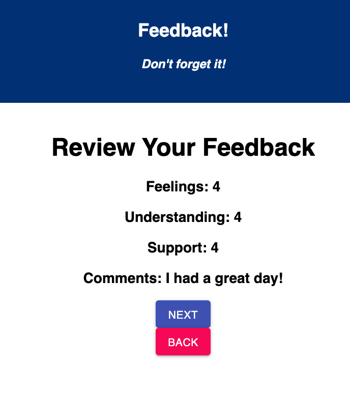
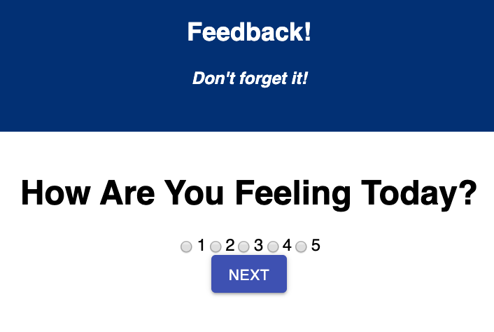
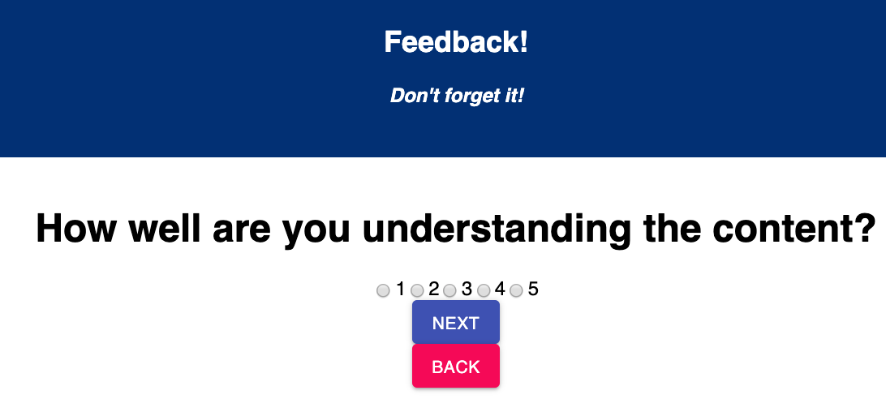
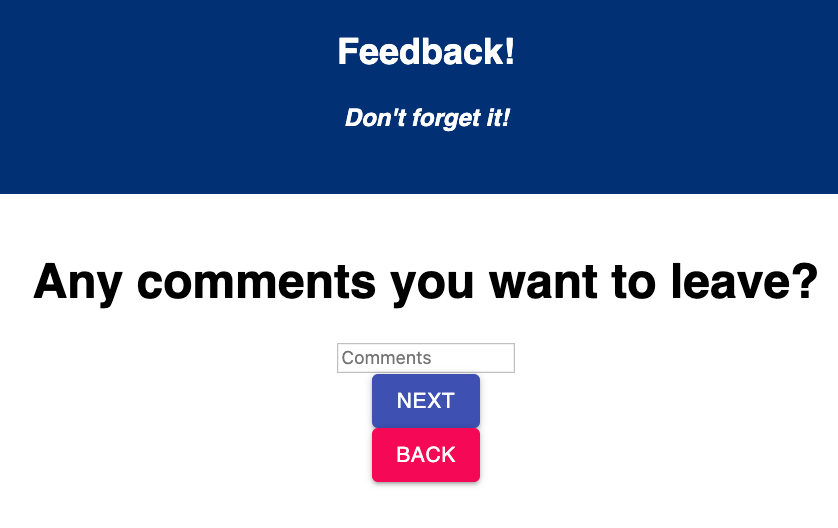

# Student Feedback

This app is designed for the users to share how their day was and store their responses.

## Screenshots



## SETUP

Create your database and tables using the provided `data.sql` file. Start the server.

```
npm install
npm run server
```

Now that the server is running, open a new terminal tab with `cmd + t` and start the react client app.

```
npm run client
```

Navigate to http://localhost:3000

## ADD NEW FEEDBACK

Create a multi-part form that allows users to leave feedback for today. 
There will be 4 views for the form parts.

The parts:
- How are you feeling today?

- How well are you understanding the content?

- How well are you being supported?

- Any comments you want to leave?


You are able to go to the next page only after you have input a number. The user is able to go back and change their answers as long as they have not submited them on the feedback review page.

## Built With

* [React](https://reactjs.org)

* [Redux](https://redux.js.org)

* [Material-UI](https://material-ui.com)

* [PostgresSQL](https://www.postgresql.org)